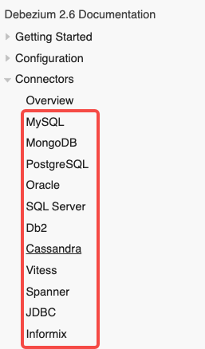

在公司的项目中，又一个需求是监听mysql表的数据变化，考虑到多种限制（其中经历了很多battle），最终选择了 [debezium](https://github.com/debezium/debezium) 作为cdc组件，经测试后上线，发现在某一个环境的服务内存占用异常高，频繁GC，最终导致OOM。在此记录下使用心得，记录下自己犯的蠢。

## Table of contents

## debezium介绍

> [官方网站在此](https://debezium.io/)
>
> Debezium is an open source distributed platform for change data capture. Start it up, point it at your databases, and your apps can start responding to all of the inserts, updates, and deletes that other apps commit to your databases. Debezium is durable and fast, so your apps can respond quickly and never miss an event, even when things go wrong.

debeizum是一个cdc（change data capture）框架，提供多种数据源的数据变更监听。听上去是和flink CDC竞争的，事实上，flink CDC依赖debezium实现CDC！但是同时debezium也可以独立于flink使用，甚至可以很方便的嵌入到一个java项目中。

## debezium的优势

根据我自身的使用体验，debezium的优势有如下几点：

1.  足够轻量，可以嵌入springboot项目中

        这一点使他可以在不用新起服务的情况下实现CDC

2.  支持多种数据源
    不仅支持mysql，也支持mongo

    

3.  支持存量数据快照

        通常而言，如果涉及到CDC，都会伴随着存量数据的处理，一般有两种选择，丢弃或者离线同步。离线同步通常就意味着额外的编码工作。
        但是debezium天然支持在接受CDC变更之前先将存量数据做一次快照，这一点对比cannel确实是有优势的。

## quickStart

TODO ！

## OOM如何产生的

TODO ！
