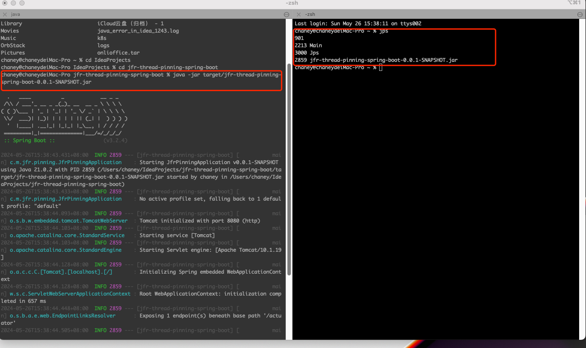
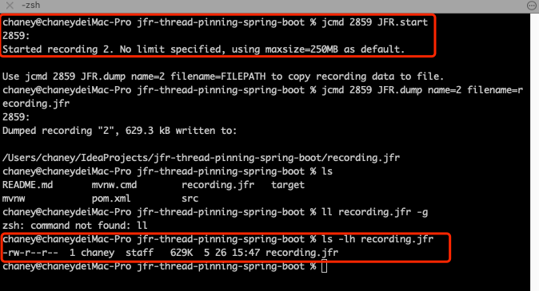
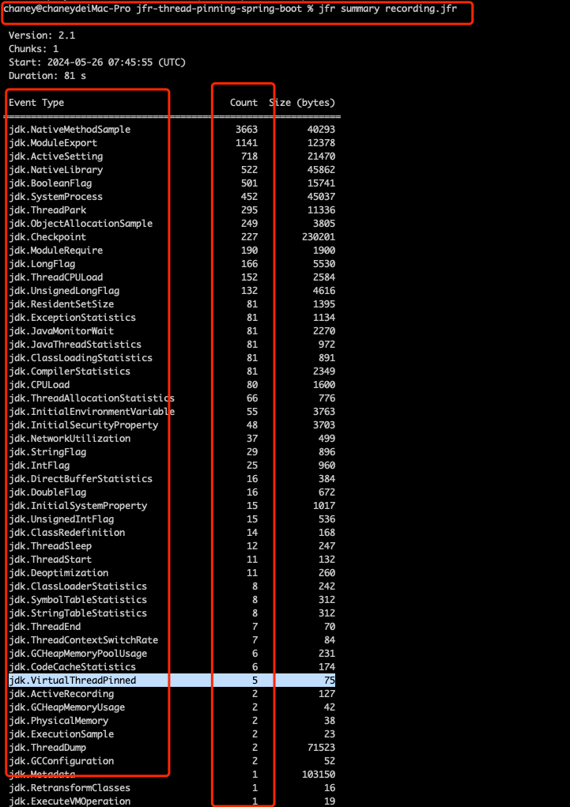
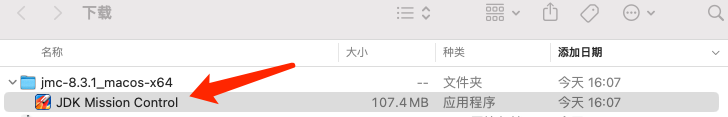
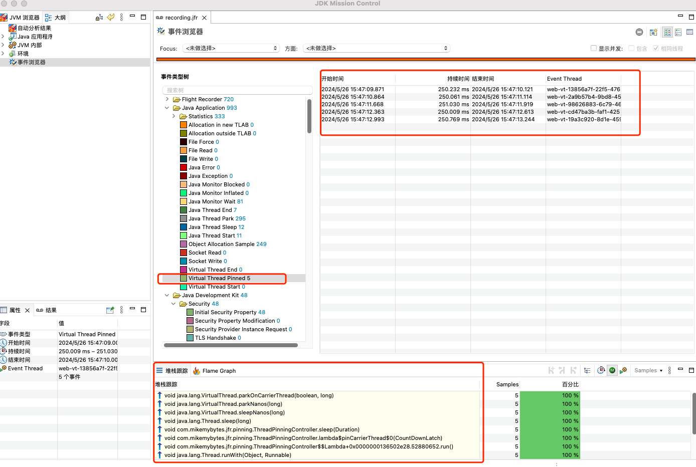

## Table of contents

本文会尝试从一下几个方面进行组织：

1. jfr介绍（为什么需要jfr）
2. jfr的常规使用（jar包部署模式 ｜ 使用jcmd导出.jfr文件）
3. event-stream以及在native模式下实现准实时监控

## jfr介绍

jfr全称`java-flight-recorder`，飞行记录仪，是在jdk11中开源的一个性能监控组件。它提供了一个低开销的java应用、jvm和操作系统的事件监控框架。
可执行文件 `jfr`内置与jdk中。
如同飞机上的黑匣子，在java应用运行过程中，它时时刻刻都在记录中多种多样的事件，详细的事件列表可以参考 [jfr事件列表](https://sap.github.io/SapMachine/jfrevents/21.html?variant=graal&version=8#introduction)

## jfr的常规使用与分析

这部分我会介绍如何快速开启jfr，分别针对传统jar包部署和native模式。

### jar包部署下：

1.  采集jfr

    通常当我们使用 `java -jar` 命令运行一个jar包后，可以通过 `jps` 命令查看系统中当前的java进程有哪些，从中我们可以找到刚刚启动的jar包进程
    
    在本次实验中进程为`2859`，然后我们就可以通过 `jcmd`命令开启jfr

    ```shell
    jcmd 2859 JFR.start

    jcmd 2859 JFR.dump
    ```

    
    现在我们就得到了一个 `recording.jfr` 文件，这个文件就是在我们刚刚采集事件期间，java应用程序、jvm、操作系统中发生的绝大多数事件。

2.  查看jfr文件

        jfr文件二进制编码文件，需要使用专门的解析工具查看。
        可以先通过 jfr命令初步查看
        ```shell
        jfr summary recording.jfr
        ```
        

        这个命令可以快速告诉我们这个jfr文件中记录的事件分布。
        但是为了更加详细地了解其中的jfr事件，我们需要用到一个工具`jmc`.这个软件是独立于jdk提供的，类似visualVM。下载地址 [jmc](https://www.oracle.com/java/technologies/javase/products-jmc8-downloads.html)

        
        运行jmc即可，将刚刚得到的jfr文件导入，在事件浏览器一栏，可以看到采集到的各种事件

        

    ß

### native-image部署模式下

在native-iamge模式下，jfr仍然可以使用，但是由于启用的java应用进程不再能被jps命令指出，也就是说，我们不能通过jcmd命令控制应用程序开始采集与结束采集jfr事件。

所以，一个可行的方案是，在运行时就开启jfr记录，通过指定max-age 和 max-size的方式控制内存和硬盘占用，当需要导出指定时间段的事件时，通过命令裁剪出所需的数据。

当前 graalvm jdk21，编译时需要加上 参数 `--enable-monitoring=jfr`, 启动时需要加上参数 `-XX:StartFlightRecording="filename=recording.jfr,settings=default.jfc,maxage=1d,maxsize=1G"`

## event-stream以及接入grafana

## 参考资料
