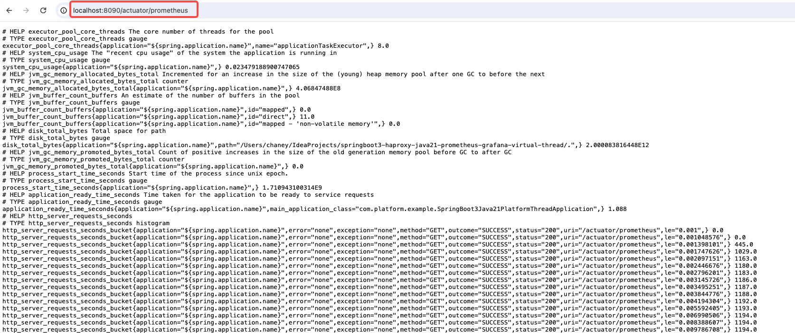
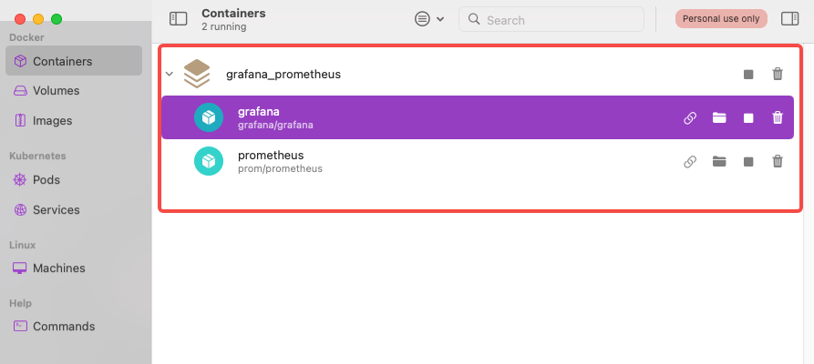
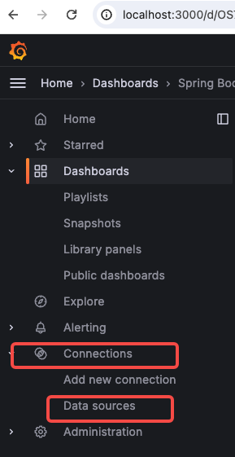
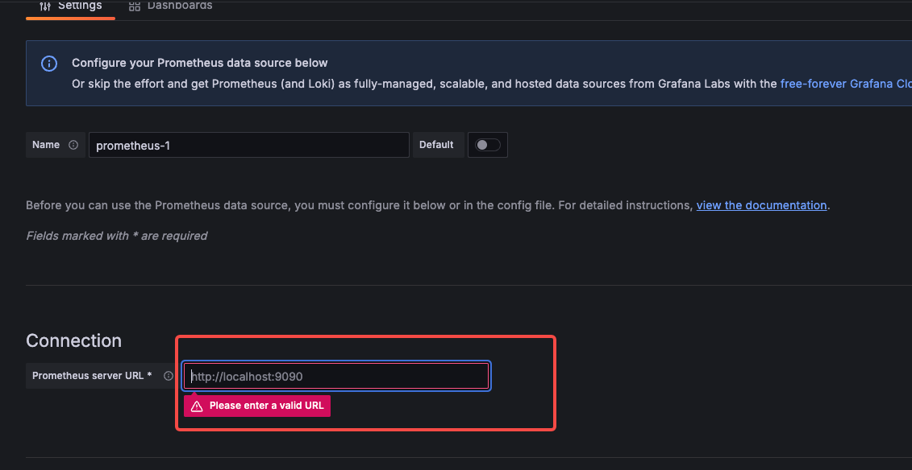
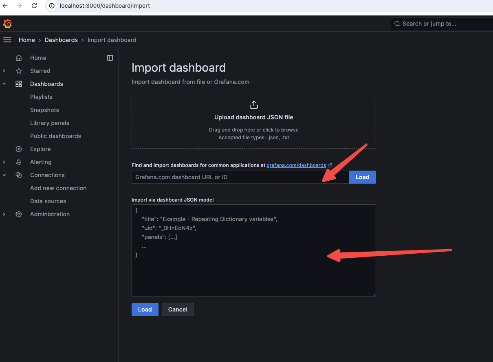

## Table of contents

企业开发中，设计监控指标和系统开发本身一样重要。项目开发初期，开发人员会更专注于功能实现和性能优化，很少注意到监控，直到需要上线前，才开始配置系统的监控，而这时如果通过监控发现可能潜在的问题（例如，响应慢，GC频繁，内存偏高，CPU占用高等），将会极大影响项目正常进度。因此在项目初期快速搭建应用监控是很有必要的。

本文将会介绍如何快速地再本地环境中通过docker-compose搭建grafana和prometheus监控

## 服务依赖于配置

以spring boot为例，在依赖中添加 prometheus 和 micrometer依赖

```xml
<dependency>
	<groupId>org.springframework.boot</groupId>
	<artifactId>spring-boot-starter-actuator</artifactId>
</dependency>
<dependency>
	<groupId>io.micrometer</groupId>
	<artifactId>micrometer-registry-prometheus</artifactId>
</dependency>
```

在配置文件中增加相关的配置项

```yml
management.endpoints.web.exposure.include=* # 暴露prometheus endpoint 通过 /actuator/prometheus 获取监控数据
management.metrics.distribution.percentiles-histogram.http.server.requests=true
management.metrics.tags.application=${spring.application.name}
management.tracing.sampling.probability=1.0 # 采样比例
```

然后启动服务，访问 /actuator/prometheus 就可以看到自动采集的数据


## 构建docker-compose

> 因为服务指标采集和大屏展示需要分别使用到 prometheus和 grafana，我们需要先构建好这两个docker容器，为了方便，我们使用docker-compose

```yml
version: "3"
services:
  prometheus:
    image: prom/prometheus
    container_name: prometheus
    ports:
      - "9090:9090"
    volumes:
      - ./prometheus:/etc/prometheus # 这个docker-compose.yml所在文件夹下 新建一个 prometheus 文件夹，用来存放 prometheus 配置
    command:
      - "--config.file=/etc/prometheus/prometheus.yml" # 见下文
    networks:
      - monitoring

  grafana:
    image: grafana/grafana
    container_name: grafana
    ports:
      - "3000:3000"
    volumes:
      - grafana-data:/var/lib/grafana
    networks:
      - monitoring

networks:
  monitoring:

volumes:
  grafana-data:
```

在启动前，还需要配置prometheus定时拉取监控数据 (prometheus.yml)

```yml
global:
  scrape_interval: 1s
  evaluation_interval: 1s

scrape_configs:
  - job_name: "application-platform-thread" # 任务名称
    scrape_interval: 1s # 拉取间隔
    metrics_path: "/actuator/prometheus" # 接口
    static_configs:
      - targets: ["host.docker.internal:8090"] # 拉取的实例，因为是从docker访问宿主机的服务，所以使用 host.docker.internal

  - job_name: "application-virtual-thread"
    scrape_interval: 1s
    metrics_path: "/actuator/prometheus"
    static_configs:
      - targets: ["host.docker.internal:8091"]
```

OK，做完以上工作，现在就可以在docker-compose.yml 文件所在文件夹 执行

```sh
docker-compose up -d
```

然后就可以看到两个容器都启动了



## 数据源配置

访问grafana地址 [http://localhost:3000](http://localhost:3000) 默认用户名密码为 admin/admin

依次选择Dashboards --> Connections --> Datasource



选择 <u>add new datasource</u> ，然后选择 prometheus



唯一需要配置的就是这个 prometheus 地址
如果是按照本教程启动的 peometheus 于 grafana，那么此处只需要固定填入 http://prometheus:9090
点击页面下方的 save&test

## 面板配置

作为快速配置，当然是去选择一个模板，然后直接使用


可以在 https://grafana.com/grafana/dashboards 搜索喜欢的模板，通过id或者json导入，在下一步选择数据源时，选择我们刚刚配置的数据源即可
