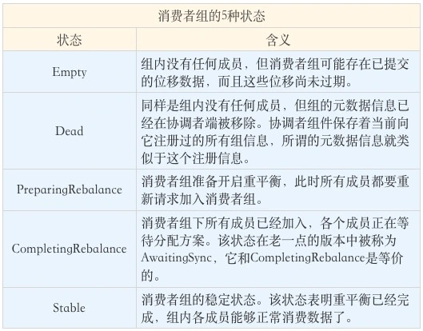
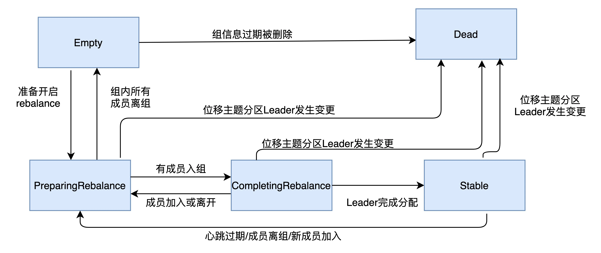
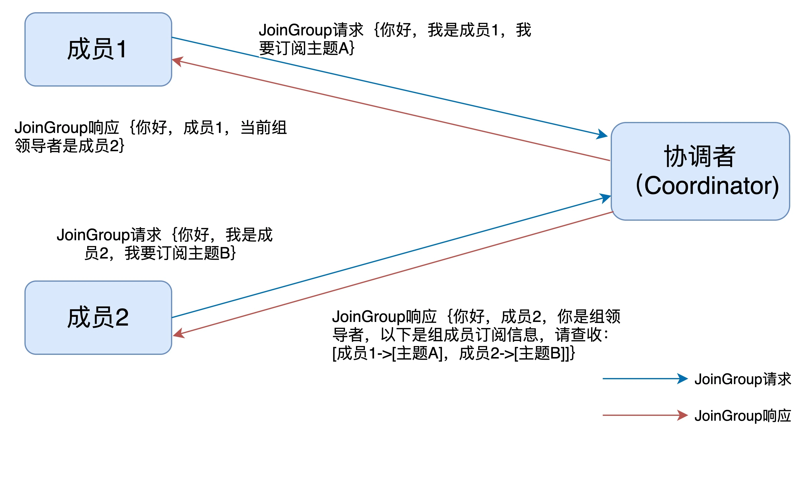
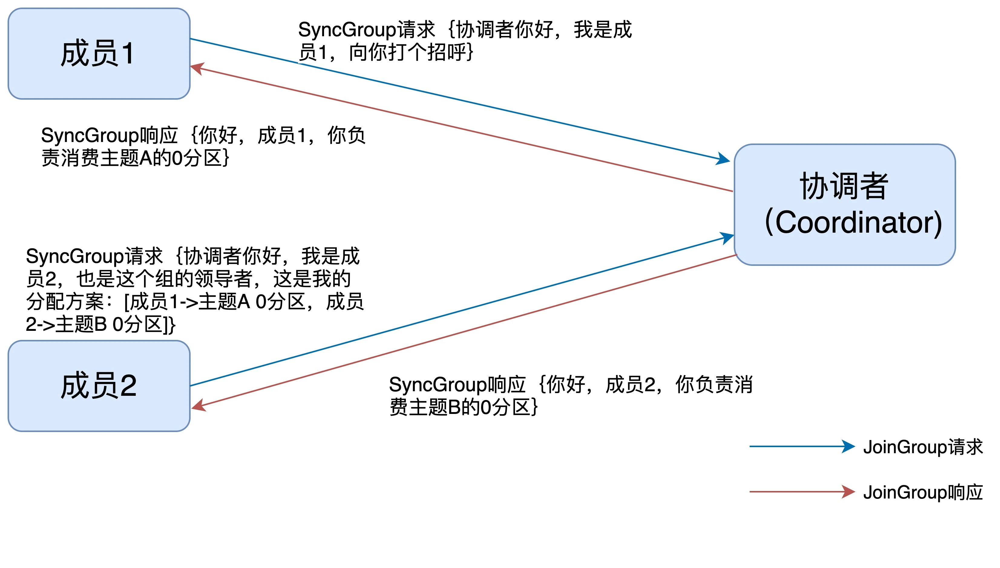

深入理解kafka重平衡

## Table of contents

本文希望回答的问题是：

> 重平衡过程是如何通知到其他消费者实例的——消费者端的心跳线程

**重平衡的通知机制正是通过心跳线程来完成的**。当协调者决定开启新一轮重平衡后，它会将“**REBALANCE_IN_PROGRESS**”封装进心跳请求的响应中，发还给消费者实例。当消费者实例发现心跳响应中包含了“REBALANCE_IN_PROGRESS”，就能立马知道重平衡又开始了，这就是重平衡的通知机制。

## 重平衡的触发与通知

1. 组成员数量发生变化
2. 订阅主题数量发生变化
3. 订阅主题分区数发生变化

## 消费者组状态机

> 重平衡一旦开启，broker端的协调者需要控制消费者组的状态流转

目前，Kafka 为消费者组定义了 5 种状态，它们分别是：Empty、Dead、PreparingRebalance、CompletingRebalance 和 Stable

各个状态之间的流转关系如下：

## 消费者端的重平衡

在消费者端，重平衡分为两个步骤：

1. 加入消费者组 --> JoinGriup请求
2. 等待领导者消费者分配方案 --> SyncGroup请求

当组内成员加入组时，它会向协调者发送 JoinGroup 请求。在该请求中，每个成员都要将自己订阅的主题上报，这样协调者就能收集到所有成员的订阅信息。一旦收集了全部成员的 JoinGroup 请求后，协调者会从这些成员中选择一个担任这个消费者组的领导者。

第一个发送 JoinGroup 请求的成员自动成为领导者。领导者消费者的任务是收集所有成员的订阅信息，然后根据这些信息，制定具体的分区消费分配方案。

选出领导者之后，协调者会把消费者组订阅信息封装进 JoinGroup 请求的响应体中，然后发给领导者，由领导者统一做出分配方案后，进入到下一步：发送 SyncGroup 请求。

在这一步中，领导者向协调者发送 SyncGroup 请求，将刚刚做出的分配方案发给协调者。值得注意的是，其他成员也会向协调者发送 SyncGroup 请求，只不过请求体中并没有实际的内容。这一步的主要目的是让协调者接收分配方案，然后统一以 SyncGroup 响应的方式分发给所有成员，这样组内所有成员就都知道自己该消费哪些分区了。

SyncGroup 请求的主要目的，就是让协调者把领导者制定的分配方案下发给各个组内成员。当所有成员都成功接收到分配方案后，消费者组进入到 Stable 状态，即开始正常的消费工作

小结：
消费者端重平衡主要通过两个请求来实现：

1. 各个消费者发送自身需要订阅的主题到协调者（join-group），其中同一个消费者组中第一个发送的是该组的领导者。（这意味着，协调者会保持消费者与其的连接）
2. 协调者在给leader消费者的join-group响应中会包含各个消费者的消费信息
3. leader消费者会根据收到的消费者消费信息生成消费方案
4. 各个消费者向协调者发送 sync-group请求，其中leader消费者会在请求中携带分配结果
5. 协调者会将消费分配结果在sync-group响应中返回给各个消费者
