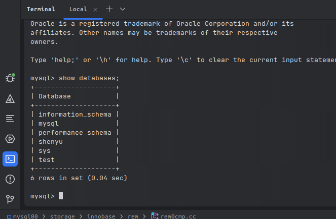
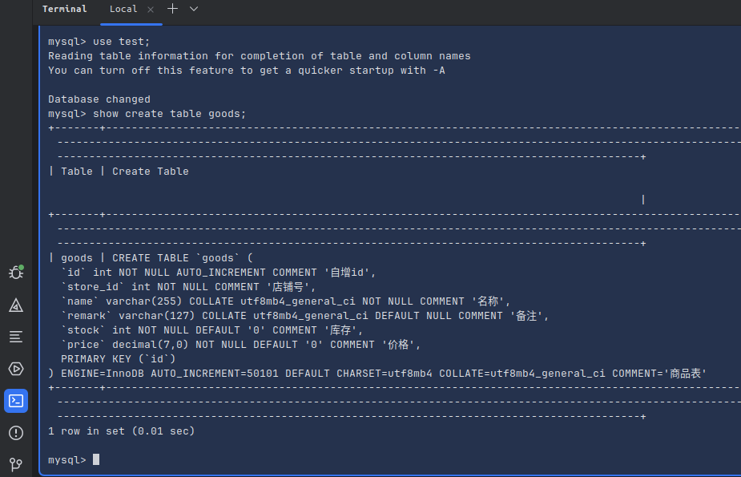
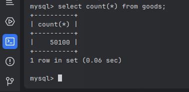
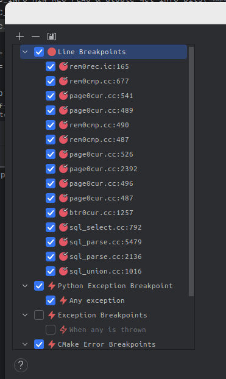

这篇文章将深入mysql源码，学习mysql如何执行下面的语句的

```sql
select * from goods where id = 5000;
```

> 注： 本文关注的是执行器操作存储引擎获取数据部分

> 注2：深入代码需要首先对n这部分流程有较为深入的理解才能看懂，也才能看得下去。
> 建议读者参考 [《MySQL 是怎样运行的：从根儿上理解 MySQL》](https://relph1119.github.io/mysql-learning-notes/#/) 第4、5、6章。了解mysql innodb引擎中一行记录在内存的结构，一个page的结构，page directory的结构，以及聚簇索引的结构。

## Table of contents

## mysql的架构图


上图极为简要的描述的mysql的架构以及sql语句的处理流程。

## 准备点数据

> 前情提要：在深入mysql的代码前，需要搭建mysql 的debug环境，可以参考[Ubuntu CLion 搭建Mysql8.0调试环境](https://buuuuuuug.github.io/posts/mysql/)

1. 启动mysql服务端，并使用命令行连接

2. 建个库，建个表

```sql
show databases;
```



```sql
use test;
show create table goods;
```

```sql
CREATE TABLE `goods` (
  `id` int NOT NULL AUTO_INCREMENT COMMENT '自增id',
  `store_id` int NOT NULL COMMENT '店铺号',
  `name` varchar(255) COLLATE utf8mb4_general_ci NOT NULL COMMENT '名称',
  `remark` varchar(127) COLLATE utf8mb4_general_ci DEFAULT NULL COMMENT '备注',
  `stock` int NOT NULL DEFAULT '0' COMMENT '库存',
  `price` decimal(7,0) NOT NULL DEFAULT '0' COMMENT '价格',
  PRIMARY KEY (`id`)
) ENGINE=InnoDB AUTO_INCREMENT=50101 DEFAULT CHARSET=utf8mb4 COLLATE=utf8mb4_general_ci COMMENT='商品表'
```



3. 插入多点数据
   一行一行插入太慢了，写存储过程最简单

```sql
create
    definer = root@`%` procedure prepare_data()
begin
    truncate goods;
    set @store_id = 0;
    while @store_id < 501
        do
            set @store_id = @store_id + 1;
            set @good_num = 0;
            while @good_num < 100
                do
                    insert into goods(store_id, name, remark, stock, price) VALUE (@store_id,
                                                                                   concat('goods ', @good_num, ' of store ', @store_id),
                                                                                   'remark', 100, 200);
                    set @good_num = @good_num + 1;
                end while;
        end while;

end;
drop procedure prepare_data;
```

执行后，表中会写入 5w+条记录



## 打上断点



以上是我认为重要的断点位置，可以方便的查看关键变量和【内存地址】，是的，我们需要很多手动访问很多的内存地址，才能知道mysql代码在干什么，以及数据在内存中是如何组织的。

> ps. 我觉得idea应该有个断点导出导入功能，方便交流嘛

## SELECT \* FROM goods WHERE id = 5000;

> 在mysql终端中发起 SELECT \* FROM goods WHERE id = 5000；

程序会停在 page0cur.cc#page_cur_search_with_match方法

```c++
/* Perform binary search until the lower and upper limit directory
  slots come to the distance 1 of each other */

  while (up - low > 1) {
    mid = (low + up) / 2;
    slot = page_dir_get_nth_slot(page, mid);
    mid_rec = page_dir_slot_get_rec(slot);

    cur_matched_fields = std::min(low_matched_fields, up_matched_fields);

    auto offsets = get_mid_rec_offsets();

    cmp = tuple->compare(mid_rec, index, offsets, &cur_matched_fields);
    ……
  }
```

这个二分查找是非常重要的，根据代码注释，可以知道，这部分代码在做的是 二分查找 page directory,知道 up 和 low之间的差小于1
