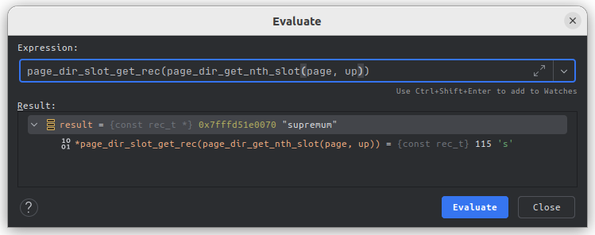

这篇文章将深入mysql源码，学习mysql如何执行下面的语句的

```sql
select * from goods where id = 5000;
```

> 注： 本文关注的是执行器操作存储引擎获取数据部分

> 注2：深入代码需要首先对n这部分流程有较为深入的理解才能看懂，也才能看得下去。
> 建议读者参考 [《MySQL 是怎样运行的：从根儿上理解 MySQL》](https://relph1119.github.io/mysql-learning-notes/#/) 第4、5、6章。了解mysql innodb引擎中一行记录在内存的结构，一个page的结构，page directory的结构，以及聚簇索引的结构。

## Table of contents

## mysql的架构图


上图极为简要的描述的mysql的架构以及sql语句的处理流程。

## 准备点数据

> 前情提要：在深入mysql的代码前，需要搭建mysql 的debug环境，可以参考[Ubuntu CLion 搭建Mysql8.0调试环境](https://buuuuuuug.github.io/posts/mysql/)

1. 启动mysql服务端，并使用命令行连接

2. 建个库，建个表

```sql
show databases;
```


```sql
use test;
show create table goods;
```

```sql
CREATE TABLE `goods` (
  `id` int NOT NULL AUTO_INCREMENT COMMENT '自增id',
  `store_id` int NOT NULL COMMENT '店铺号',
  `name` varchar(255) COLLATE utf8mb4_general_ci NOT NULL COMMENT '名称',
  `remark` varchar(127) COLLATE utf8mb4_general_ci DEFAULT NULL COMMENT '备注',
  `stock` int NOT NULL DEFAULT '0' COMMENT '库存',
  `price` decimal(7,0) NOT NULL DEFAULT '0' COMMENT '价格',
  PRIMARY KEY (`id`)
) ENGINE=InnoDB AUTO_INCREMENT=50101 DEFAULT CHARSET=utf8mb4 COLLATE=utf8mb4_general_ci COMMENT='商品表'
```


3. 插入多点数据
   一行一行插入太慢了，写存储过程最简单

```sql
create
    definer = root@`%` procedure prepare_data()
begin
    truncate goods;
    set @store_id = 0;
    while @store_id < 501
        do
            set @store_id = @store_id + 1;
            set @good_num = 0;
            while @good_num < 100
                do
                    insert into goods(store_id, name, remark, stock, price) VALUE (@store_id,
                                                                                   concat('goods ', @good_num, ' of store ', @store_id),
                                                                                   'remark', 100, 200);
                    set @good_num = @good_num + 1;
                end while;
        end while;

end;
drop procedure prepare_data;
```

执行后，表中会写入 5w+条记录


## 打上断点


以上是我认为重要的断点位置，可以方便的查看关键变量和【内存地址】，是的，我们需要很多手动访问很多的内存地址，才能知道mysql代码在干什么，以及数据在内存中是如何组织的。

> ps. 我觉得idea应该有个断点导出导入功能，方便交流嘛

## SELECT \* FROM goods WHERE id = 5000;

> 在mysql终端中发起 SELECT \* FROM goods WHERE id = 5000；

程序会停在 page0cur.cc#page_cur_search_with_match方法

```c++
/* Perform binary search until the lower and upper limit directory
  slots come to the distance 1 of each other */

  while (up - low > 1) {
    mid = (low + up) / 2;
    slot = page_dir_get_nth_slot(page, mid);
    mid_rec = page_dir_slot_get_rec(slot);

    cur_matched_fields = std::min(low_matched_fields, up_matched_fields);

    auto offsets = get_mid_rec_offsets();

    cmp = tuple->compare(mid_rec, index, offsets, &cur_matched_fields);
    ……
  }
```

这个二分查找是非常重要的，根据代码注释，可以知道，这部分代码在做的是 二分查找 page directory,直到 up 和 low之间的差小于1。

在继续往下看之前，我们需要知道page directory 结构是什么样的。


图中为一个page的简化结构，可以看到这个page被分成了多个group，每个组只有少数几条记录，每个组与旁边的一列“方块”有着联系。

实际上，左侧的一列方块也是这一个page的一部分，在物理内存上位于比用户记录更高的地址空间,如下图所示：


每一个slot存储的内容是什么呢，观察可以发现，每个slot中存放的数据似乎是指向对应group的最大记录的记录头信息之后，真实列数据之前的地址，我们一会儿可以在代码中验证这一点。

先继续回到上面的代码，代码中的 `up` 和 `low` 代表的是什么呢？
结合上面的图，可以知道，他们就是 这个 page directory中 多个slot的*位置索引*，
开始时，`up = 53` `low = 0`,代表着这个页面一共有54个`slot`，也就是被分为了 54组，这个二分查找就是在寻找这样一个slot：

它的指向的那条记录所在的那个`group`,就是我们指定的 `id = 5000` 的记录 所在的group。

将请求断点在`while`循环中，可以看到第一次循环时，各个主要变量 的值如下

第一遍循环，`up = 53, low = 0`,得到的 `mid slot` 为第26个slot，然后根据这个slot存储的`指针` 找到`mid_rec`，地址为 `0x7fffd51e0620`。

根据我们之前的猜测，这个地址应该是一条记录，我们实际看一下内存中这个地址数据，如下：

.再一次，结合前置知识，我们知道这个地址对应的是一条记录的 `数据开始位置`，往左是记录头信息，往右是`主键列的值`——通过这一点，我们能确定，当前内存中的 `80 00 5f 30` 就是这个页中，26 group 中id最大的一条的id.

> 此处需要提醒一下，四个字节表示一个id太富余了，实际上前两个字节 `0x8000`，转为二进制 为 `1000 0000 0000 0000`，有点像i符号位的意思，咱就先这么理解
> ，之后我插入一条 id为负数的试一下。

我们着重看后两个字节, `0x5f30` ---十进制---> `24368`，为什么是这个数字？
想到前面有个 `mid = (low + up) / 2`，一个页内，group中记录的数量是近似一致的，那么我们可以猜测，up 那个 slotu存储的地址，对应的记录的id是近似两倍于 这个 24368的,

使用clion自带的表达式运行器，执行一下，得到`up`指向的记录，哈哈哈，是 `supremum`，这个页中最大的记录,而且，物理内存上看，supremum 紧挨着的是infinum,物理内存上的iaa下一条记录是 本页id最小的记录。

不是我们想要的最大id（50100），但是我们知道up是53，那么倒数第二个slot应该是 52，看一下：
，

`0xbf10 = 48912`，嗯~，这个看着合理多了，接近50000的id。通过刚刚的一系列操作，我们知道了：

1. 当前这个页有0到53一共54个组
2. 当前代码在做的事情是找出我们i希望的 5000 所在的组
3. 我们验证了 supremum 确实是页面最大的记录，它总是在最后一个slot指向的地址处

再回到 `mid=26`，我们刚刚已经查到了 26号slot指向的记录的地址，我们只需要将这条记录的id和我们希望的 5000 对比一下，就能知道这个二分查找的上下限应该怎么调整了。

那我们接着往下看，来到了真实比较id的地方：

```c++
for (ulint i = 4 + (len & 3); i > 0; i--) {
      // data1 就是 5000 地址指针，data2 就是当前的记录id指针
      cmp = int(*data1++) - int(*data2++);

      if (cmp != 0) { // 比较出了不相同的一个字节
        return (is_asc ? cmp : -cmp);
      }

      if (!--len) {
        break;
      }
    }
```

`data1` 就是我们查询的id，5000 (0x1388 = 5000)

`data2`就是当前e这条被用来比较的记录的id

`0x5f30`前面已经算过了，24368，也就是 `mid`
这点在我们的意料o之中，但是，这个比较为什么是 循环呢？不是简单的

```c++
return 5000 > 24368;
```

这个呢，是大佬们发现在 x86-64 cpu上，`memcp` 性能很拉胯，决定不用它了，自己写一个！一句话概括就是，循环四个字节，高位到地位，逐个字节比较。

当前就是分别比较 (0x80,0x80),(0x00,0x00), (0x13,0x5f),(0x88,0x30)

很显然，当前这个`mid`太大了，按照二分查找的思路，应该修改 `up=mid`


不出所料！接下来就不一遍一遍走这个循环了。

Boom!跳出循环后：

`low = 5`, `up = 6`

显然，我们要找的记录5000存在于编号为6的group中，
既然已经知道在这个group，直接遍历这个group就好了呗。

```c++
// 循环退出条件为：low_rec.next  = up_rec
while (page_rec_get_next_const(low_rec) != up_rec) {
    // 获取low_rec 的下一条记录
    mid_rec = page_rec_get_next_const(low_rec);//min_record 每次增加240？？为什么呢

    cur_matched_fields = std::min(low_matched_fields, up_matched_fields);

    auto offsets = get_mid_rec_offsets();

    // 比较
    cmp = tuple->compare(mid_rec, index, offsets, &cur_matched_fields);

    if (cmp > 0) {
    // low < target
    low_rec_match:
      // low = low.next
      low_rec = mid_rec;
      low_matched_fields = cur_matched_fields;

    } else if (cmp) {
    up_rec_match:
      up_rec = mid_rec;
      up_matched_fields = cur_matched_fields;
    }
}
```

代码逻辑也确实如此，舒坦，非常舒坦！

跳出循环时：

```
up_rec = 0x1435 = 5173
low_rec = 0x1345 = 4933
```

已经非常接近 5000了。

为了方便大家理解后面 的代码，需要指出，mysql在跳出这个循环后还做了一次数据封装

```java
// 将low_rec 和 block信息赋值给 cursor
page_cur_position(low_rec, block, cursor)
```

```c++
if (level != height) {
    const rec_t *node_ptr;
    ut_ad(height > 0);

    height--;

    node_ptr = page_cur_get_rec(page_cursor);

    offsets = rec_get_offsets(node_ptr, index, offsets, ULINT_UNDEFINED,
                              UT_LOCATION_HERE, &heap);

    /* Go to the child node */
    page_id.reset(space, btr_node_ptr_get_child_page_no(node_ptr, offsets));

    n_blocks++;

}
```

接下来有一个重要判断：`(level != height)`,判断的是当前 height 是不是 希望的 B+tree的那一层，在我们这个例子中，现在 `level==0`，表示a需哟查询到 B+tree的第0层，也就是e叶子结点，而当前 `height==1`,表示在叶子节点上一层。

所以还需要进入下一层才能查询到我们需要的 5000id。

但是，目前为止我们可以知道：

1. 我们这个例子中，B+tree有两层
2. 第1层只有一个page，这个page中有 54 个 slot

经过上面的代码后，下一层叶子节点对应的页号就i知道了。


之后的代码逻辑，和上一层几乎一致：

1. 找到对应的页
2. 查找 page_directory，确定在哪一个group
3. 组内 遍历 直到匹配

我就不再重复了：
下面贴上在叶子节点匹配的结果：

这是我们传入的 5000


这是真实叶子节点中数据，也有个 `0x8000 1388`, 也就是 5000


紧挨着的g内存中我们已经可以看到其他字段的值了，当然哈，这个 `8000 1388` 并不是这条记录的起始位置，前面还有很多 记录的额外信息。

done

遗留的问题：

1. 在组内顺序遍历的时候，取下一个记录的方法：
   `page_rec_get_next_low` --> `page_align`:

```c++
/** Gets the start of a page.
 @return start of the page */
static inline page_t *page_align(
    const void *ptr) /*!< in: pointer to page frame */
{
  return ((page_t *)ut_align_down(ptr, UNIV_PAGE_SIZE));
}


static inline void *ut_align_down(const void *ptr, ulint align_no) {
  ut_ad(align_no > 0);
  ut_ad(((align_no - 1) & align_no) == 0);
  ut_ad(ptr);

  static_assert(sizeof(void *) == sizeof(ulint));

  return ((void *)((((ulint)ptr)) & ~(align_no - 1)));
}
```

没看懂怎么从一条记录取到这个page的起始地址的！！
