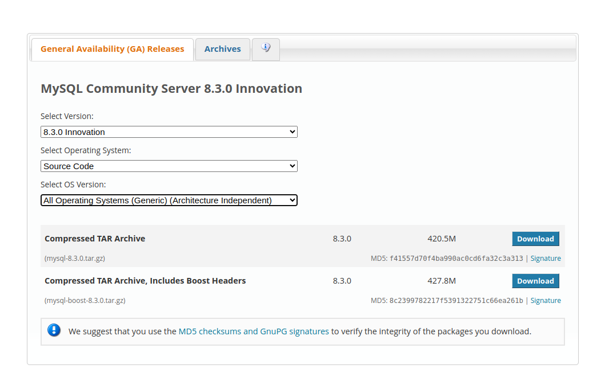
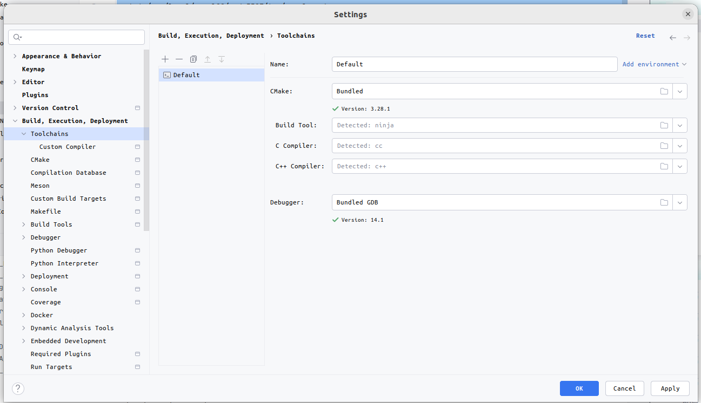
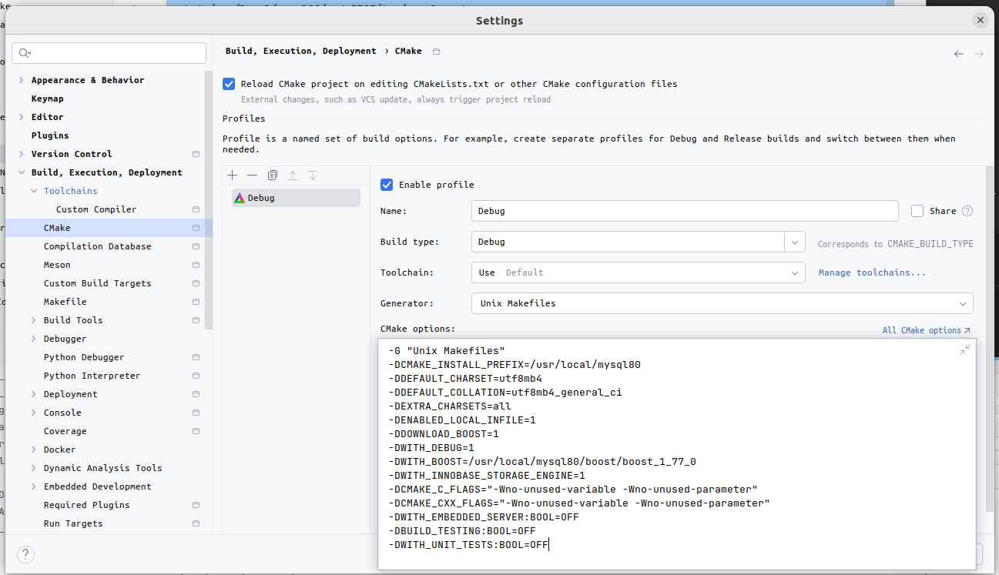
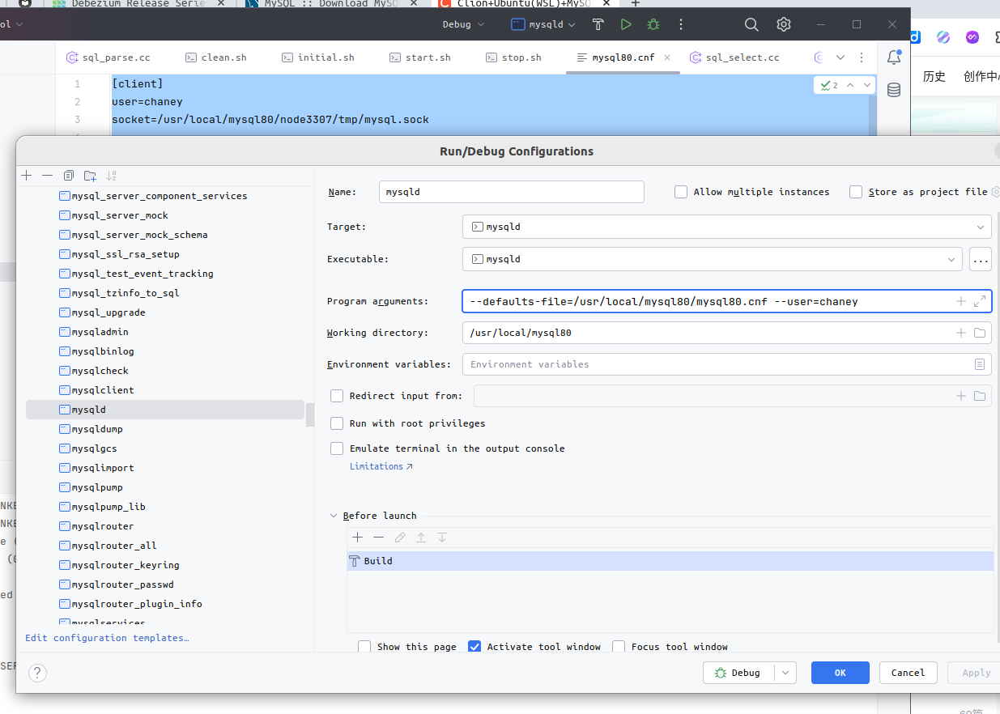
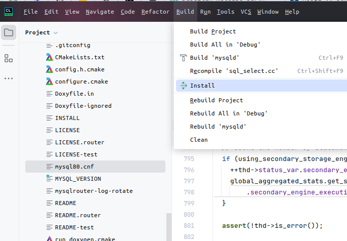
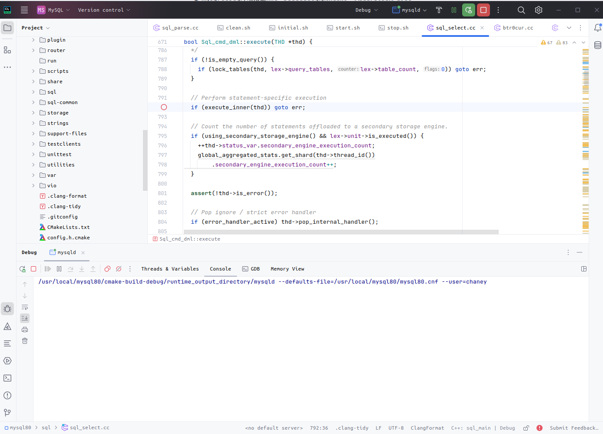
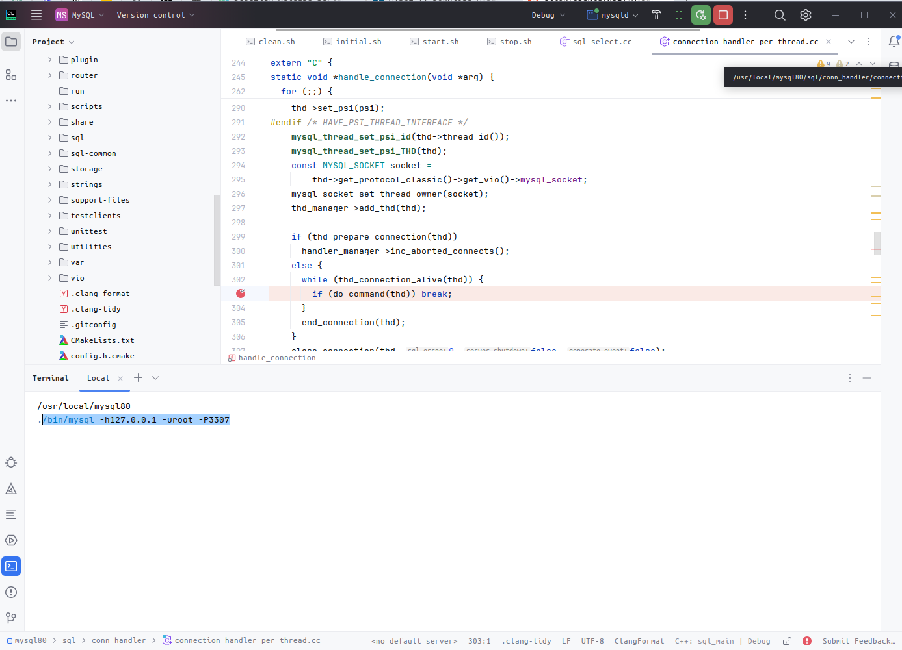

起因：想起工作两三年了，和mysql打交道的时间最多，哈哈哈，但是居然还没有自己阅读过其中的代码，一些特性也只是从一些书籍、文章中了解。
总归还是觉得缺点什么，或许叫做“亲眼所见的震撼”——个人对一些伟大的开源项目始终心存敬畏。

近期将自己常用的笔记本的系统从windows切换到了Ubuntu22.04，想起这应该是一个比较轻松的物理环境，可以让自己去折腾一下，免除win下各种依赖的问题。

预告一下：整个过程非常轻松，完全没有一步一卡的情况，这个二三十万行代码的精细项目显得非常*温和*

## Table of contents

## 下载源代码

可在 [这儿](https://dev.mysql.com/downloads/mysql/)下载对应版本的源代码，按照图中的筛选条件，选择第二个下载即可。



## 安装必要的依赖和调试工具

1. 安装gcc

```sh
sudo apt install gcc-11
```

2. 安装编译和调试工具

```sh
sudo apt install build-essential cmake libncurses5-dev libssl-dev libboost-all-dev gdb
```

## 启动数据目录配置

1. 将下载的源码a解压到 /user/local下

```sh
sudo tar xvf mysql-boost-8.3.0.tar.gz /user/local/mysql80
```

2. 进入 /user/local/mysql80目录并创建数据目录

```sh
cd /user/local/mysql80
mkdir node_working # 数据目录
mkdir node_working/data # 真正存储表数据的文件
mkdir node_working/logs # 日志目录
mkdir node_working/temp # mysqlg运行期间临时文件目录
```

3. 创建mysql的常用脚本 均在/user/local/mysql80
   clean.sh

```sh
#!/bin/bash

rm -rf ./data/*
rm -rf ./logs/*
rm -rf ./tmp/*
```

initial.sh

```sh
#!/bin/bash

./clean.sh

/usr/local/mysql80/bin/mysqld --defaults-file=/user/local/mysql80/mysql80.cnf --initialize-insecure
```

start.sh

```sh
#!/bin/bash

./stop.sh
nohup /usr/local/mysql80/bin/mysqld --defaults-file=/usr/local/mysql80/mysql80.cnf > ./start.log 2>&1 &
```

stop.sh

```sh
#!/bin/bash

ps -ef | grep mysqld | grep -v grep | awk '{print $2;}' | xargs -I {} kill -9 {}
```

然后回到 mysql80目录下，也就是源代码目录
新建一个配置文件mysql80.cnf

```
[client]
user=chaney
socket=/usr/local/mysql80/node3307/tmp/mysql.sock

[mysqld]
user=chaney
#init-file=/usr/local/mysql80/init.file
core-file
skip-name-resolve                       = 1
default-storage-engine                  = InnoDB
basedir                                 = /usr/local/mysql80
datadir                                 = /usr/local/mysql80/node3307/data
tmpdir                                  = /usr/local/mysql80/node3307/tmp
plugin-dir                              = /usr/local/mysql80/lib/plugin
pid-file                                = /usr/local/mysql80/node3307/tmp/mysql.pid
port                                    = 3307
socket                                  = /usr/local/mysql80/node3307/tmp/mysql.sock
log-error=/usr/local/mysql80/node_working/logs/mysqld.log
server-id=99
```

## CLion配置

使用CLion打开 `mysql80` 目录

1. 配置toolchain

   

2. 配置cmake

   

上图中的cmake参数为

```txt
-G "Unix Makefiles"
-DCMAKE_INSTALL_PREFIX=/usr/local/mysql80
-DDEFAULT_CHARSET=utf8mb4
-DDEFAULT_COLLATION=utf8mb4_general_ci
-DEXTRA_CHARSETS=all
-DENABLED_LOCAL_INFILE=1
-DDOWNLOAD_BOOST=1
-DWITH_DEBUG=1
-DWITH_BOOST=/usr/local/mysql80/boost/boost_1_77_0
-DWITH_INNOBASE_STORAGE_ENGINE=1
-DCMAKE_C_FLAGS="-Wno-unused-variable -Wno-unused-parameter"
-DCMAKE_CXX_FLAGS="-Wno-unused-variable -Wno-unused-parameter"
-DWITH_EMBEDDED_SERVER:BOOL=OFF
-DBUILD_TESTING:BOOL=OFF
-DWITH_UNIT_TESTS:BOOL=OFF
```

其中 `DWITH_BOOST=/usr/local/mysql80/boost/boost_1_77_0` 参数需要根据实际下载的源代码版本gg指定，如果下载的是带 boost版本，那么boost文件就是在 源码目录下的 `/boost` 目录

在CLion右上角选择`mysqld`可执行文件，点击 编辑，在argements 一栏填入



## 构建 & 启动

经过前面的配置，胜利就在眼前了

1. install

   

   此步骤相当于在源码根目录执行 `make install` 会需要比较长时间，CPU 和内存占用也会很高，我的笔记本就被迫重启了两次才编译完成。

2. 初始化
   在 源码 根目录，执行

```sh
./bin/mysqld --defaults-file=mysql80.cnf --initialize-insecure
```

3. debug启动mysql
   现在，直接点击右上角n可执行文件 `mysqld`旁边的debug，就可以等待mysqln启动了

   

4. 登录mysql

```sh
./usr/local/mysql80/bin/mysql -uroot -S /home/mysql80/node_working/tmp/mysql.sock
```

修改登录 权限

```sql
update mysql.user set host='%' where user='root';
```

5. 重启debug

## 打个断点



然后在终端执行

```sh
./bin/mysql -h127.0.0.1 -uroot -P3307
```

就能看到程序停在断点处，那么接下来，就可以 随心所欲的show了
